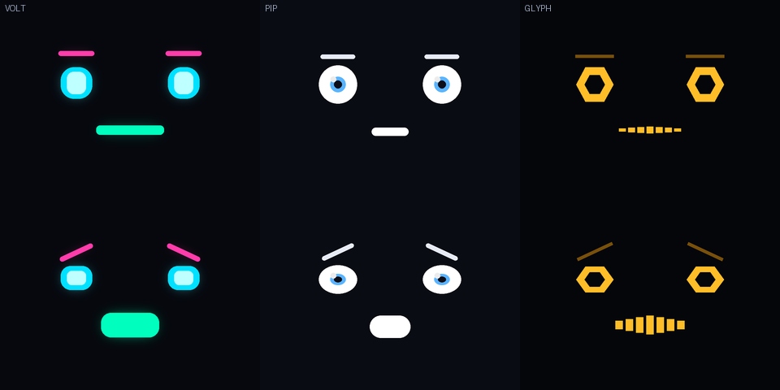
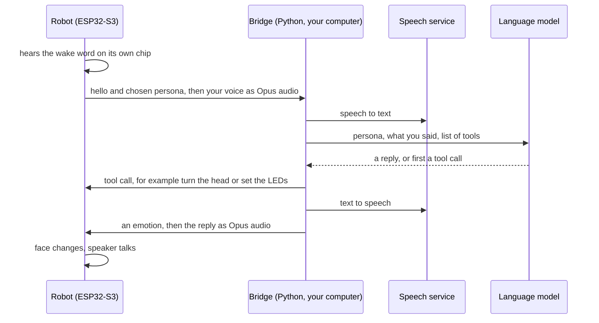
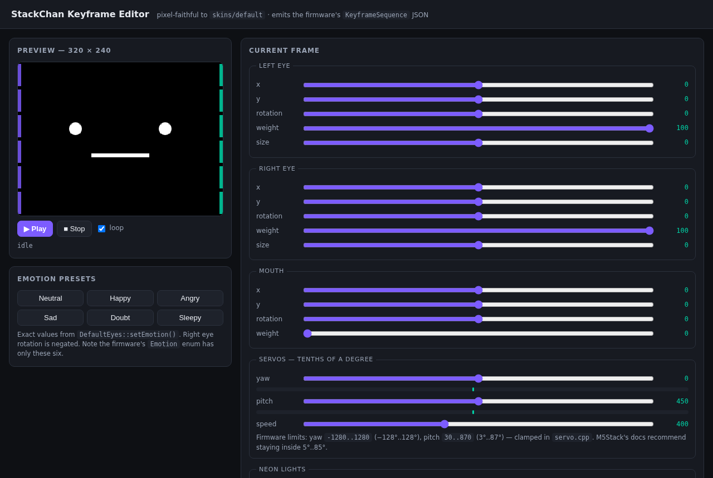

<p align="center">
  
</p>

# StackyChan

**A desk robot with a face you can swap, a brain you choose, and a settings page it serves itself.**

**Version `9.9.3-stackychan`** — the firmware version, set in one place
([`firmware/CMakeLists.txt`](firmware/CMakeLists.txt)). The robot shows the same string at
the bottom of its settings page and in its boot log.

StackyChan is custom firmware for the [M5Stack StackChan](https://docs.m5stack.com/en/StackChan),
a small open-source desk robot. It is a fork of M5Stack's own firmware and keeps what
that firmware does, with one thing switched off on purpose: its silent self-update. On
top, this fork adds new faces, a web page that configures the whole robot, and a small
server that lets it talk through Claude, ChatGPT or a free model.

> **Honest status.** This is a one-person hobby project that runs on one real robot.
> Some features have been seen working on that robot. Others have only been built,
> simulated or tested against a fake device. The table under
> [What is proven](#what-is-proven-and-what-is-not) says which is which. The animation
> above is a simulator render of the real face code, not a video of the hardware.

## Contents

- [The robot](#the-robot)
- [The faces](#the-faces)
- [How it works](#how-it-works)
- [What this firmware adds](#what-this-firmware-adds)
- [What is proven and what is not](#what-is-proven-and-what-is-not)
- [Try it without a robot](#try-it-without-a-robot)
- [Build and flash](#build-and-flash)
- [Things that bit us](#things-that-bit-us)
- [Where things live](#where-things-live)
- [Credits](#credits)
- [Licence](#licence)

## The robot


StackChan is a palm-sized robot built around the M5Stack **CoreS3** controller:

- ESP32-S3 chip, 16 MB flash, 8 MB PSRAM, Wi-Fi and Bluetooth
- a 2-inch (51 mm) touch screen, 320 x 240 pixels, which is the face
- two microphones and a small speaker
- two servos, so the head turns and nods
- two rows of RGB LEDs, a camera, a motion sensor and a battery

It was created by Shinya Ishikawa and grown by a community; M5Stack sells a kit and
publishes the firmware this fork starts from. *(Product photo: M5Stack.)*

<br clear="right">

## The faces

A face is called a **skin**. The stock firmware has one, hardcoded in five places. This
fork turns the face into a setting and ships three.

<table>
  <tr>
    <td align="center"><br><b>MAX</b><br>a 1980s TV host made of signal</td>
    <td align="center"><br><b>VOLT</b><br>a neon heads-up display</td>
    <td align="center"><br><b>Default</b><br>M5Stack's stock face, unchanged</td>
  </tr>
</table>

Every skin answers the same six emotions the robot already knows. The speech server
picks the emotion; the skin decides what it looks like.

<p align="center"></p>

All of these pictures come from [`workshop/sim`](workshop/sim/README.md), a desktop
program that compiles the **real** skin source files against desktop LVGL and writes
PNGs at the screen's exact size and colour depth. The stills are its normal output. The
animations drive the same skin classes through in-between eye, mouth and gaze values.

**How MAX is drawn.** A full-screen picture redrawn every frame would be slow. So the
art that never moves (backdrop, hair, suit, tie) is baked once into a 320 x 240 image and
stored in flash. Only the sunglasses, the glints, the eyebrows and the grin are live
shapes drawn on top. A frame costs one image copy plus a handful of rectangles.

<p align="center"></p>

**Making your own.** A skin is one C++ class that implements `SkinBase`. Keep to the
"feature contract" (position -100..100, openness 0..100, size -100..100, rotation in
tenths of a degree) and every existing behaviour drives your face for free: blinking,
breathing, lip-sync, idle motion, gaze. The steps are short:

1. Draw the art. `workshop/design/` holds the scripts that drew MAX and the candidates below.
2. Convert it with `workshop/tools/photo2asset.py` (any photo or PNG to an on-device image).
3. Write the class, register it in `firmware/main/stackchan/avatar/skins/skins.cpp`.
4. Render it in the simulator **before** you build firmware.

<p align="center"></p>

*Design candidates from `workshop/design/render_chars.py`. Only VOLT was built. PIP and
GLYPH are sketches. A BMO skin is the next one wanted and is not started.*

## How it works

**The robot holds no language model.** It is a microphone, a speaker and a face. It
listens for a wake word on its own chip. After that it streams your voice to a server,
and plays back whatever audio the server returns. Speech-to-text, the model and the
voice all live on the server. There is nowhere on the robot to put an API key.

So "run it on Claude" is not a firmware feature. It is a choice of **which server the
robot points at**. This repo includes one: the **bridge**, a small Python program you run
on any computer on your network.



The robot's own settings page says the same thing, and shows who is signed in on the bridge:

<p align="center"></p>

Everything between robot and bridge travels over one WebSocket, using the open
[xiaozhi](https://github.com/78/xiaozhi-esp32) protocol the stock firmware already
speaks. The full message format is written down in
[`server/bridge/README.md`](server/bridge/README.md), in case you would rather write
your own server.

## What this firmware adds

### A web page that configures the whole robot

The robot serves its own settings page on port 80, at `http://stackchan.local/`. The page
is embedded in the firmware, so it needs no files and no internet.

<p align="center"></p>

| page | what you can set |
|---|---|
| Overview | read-only status: version, network, active face, persona, wake word |
| Network | DHCP or a static address, DNS, hostname |
| Time | NTP servers and timezone |
| AI backend | which server the robot talks to, and which model it asks for |
| Personas | up to 8 characters, each with its own instructions, voice and face |
| Memory | notes the bridge adds to every conversation, and how much chat history it keeps |
| Face & body | the skin, live control of eyes, mouth, head and LEDs, the screensaver |
| Music | song upload to the SD card (blocked for now, see the table below) |
| Wake word | which of eleven trained phrases starts a conversation |
| Update | drag-and-drop firmware update, a network test, a way back to stock |

<table>
  <tr>
    <td></td>
    <td></td>
  </tr>
  <tr>
    <td align="center"><i>Live control: expression, gaze, head, lights</i></td>
    <td align="center"><i>Personas travel with every conversation</i></td>
  </tr>
</table>

Two details worth knowing:

- **A bad static address cannot strand the robot.** A new address is applied on a
  two-minute timer. Loading the page at the new address cancels the timer. If you never
  get there, it goes back to DHCP and reboots.
- **Firmware uploads are sent in about 120 small pieces**, each retried on its own. One
  large upload across a home router failed silently; small ones do not.

### A bridge to Claude, ChatGPT or a free model

The bridge has its own sign-in page. Paste an API key, the bridge checks it with the
provider, and you pick who answers. Keys stay on the bridge. They are never sent to the
robot and never shown again.

<p align="center"></p>

- **Paid:** Claude (Anthropic) and ChatGPT (OpenAI).
- **Free tiers:** Groq, Google Gemini, OpenRouter's free models, Cerebras, Mistral.
- **Local:** any model served by Ollama on your own machine.
- **Hearing and the voice are separate from who answers.** Only OpenAI and Groq offer
  both speech-to-text and text-to-speech, so one of those two must be signed in.
  Claude or Gemini alone can think but cannot hear or speak.

Details, settings and the wire protocol: [`server/bridge/README.md`](server/bridge/README.md).

### Things you can ask it to do

The model can call tools. They come from three places:

- **The robot's own tools**, found automatically: turn the head, set the LED colour,
  set reminders, and play one of four gestures (happy, robot, panic, look around).
- **Tools inside the bridge:** the weather (free [Open-Meteo](https://open-meteo.com/)
  data, no key) and pausing network ad-blocking on a [Pi-hole](https://pi-hole.net/).
- **Any outside MCP server**, added in the bridge's settings. This one works with Claude only.

### The rest

- **Eleven wake phrases**, all running on the chip: Hi Stack Chan, Jarvis, Computer,
  Hi M Five, Hi Wall-E, Mycroft, Hey Wanda, Hey Willow, Sophia, Hey Kira, Hi Jason.
- **Gaze.** The eyes lead the head into a turn and settle when it stops. Without that,
  the eyes look dragged along. It works on every skin.
- **Personas.** A name, instructions, a voice and a face. Pick one in the portal and the
  character changes on the next thing you say.
- **Four small screens** on the robot itself: a clock, the weather, one stock ticker, and
  a face picker.
- **Protection from the stock updater.** Stock firmware downloads and installs M5Stack's
  image at boot without asking. That replaces a custom build the first time it reaches
  the internet. It is switched off here.
- **A browser keyframe editor** for expressions and head moves
  (`workshop/portal/keyframe-editor.html`). It writes the same JSON the firmware plays.
  It cannot yet push to the robot.
- **A Windows recovery kit** (`workshop/kit/`): diagnose, erase, flash, read the boot
  log, find the robot on the network, or put M5Stack's firmware back.

<p align="center"></p>

## What is proven and what is not

The machine that builds this firmware has no USB port and no route to the robot. It can
compile and simulate. It can never flash. Every hardware result below came from flashing
the robot by hand on another PC and reading its boot log. [docs/STATUS.md](docs/STATUS.md)
has the detail behind each row.

| feature | state |
|---|---|
| MAX face on the real screen | **Seen on the robot** |
| Web portal served by the robot | **Seen on the robot** (an early portal crash was found there) |
| Wake word fires | **Seen on the robot** (boot log: `Wake word detected: Hi,Stack Chan`) |
| Stock updater replacing a custom build | **Seen on the robot**, which is why the guard exists |
| Conversation after the wake word (audio-task fix) | Fixed in code. **Not confirmed** on the robot |
| Persona face picker fix | Fixed in code. **Not confirmed** on the robot |
| Chunked firmware upload | Built. No hardware confirmation on record |
| VOLT face, gaze | Simulator and build only. No written hardware confirmation |
| Live face switching, clock, weather, stock and face-picker screens | Built. **No hardware run on record** |
| Gesture tool (`play_gesture`) | Built. No run on the robot on record |
| Bridge: Claude, ChatGPT, free providers | Self-test passes (137 checks, fake robot, fake providers). **No real conversation has ever happened**, and it has never been connected to the robot |
| Bridge sign-in page | Exercised in a browser with fake keys against the real providers' error replies |
| Weather and Pi-hole tools | Self-test with faked web replies only |
| xiaozhi.me relay (`xiaozhi_mcp_relay.py`) | Handshake, tool list and keep-alive checked against the real service. No real tool call yet |
| Music from the SD card, `dance_to_song` | **Blocked.** Compiles, but cannot mount a card (see below) |
| KIE.ai media setting | A setting only. Nothing calls it |

There is **no prebuilt download.** To run this firmware you build it yourself.

## Try it without a robot

All three run on a normal computer. None needs hardware or an API key.

**See the faces.** Build the simulator and render every skin and emotion to PNG:

```bash
git clone --depth 1 -b v9.4.0 https://github.com/lvgl/lvgl.git workshop/sim/lvgl
cd firmware && python3 fetch_repos.py && cd ..   # firmware dependencies; the simulator links two
cmake -S workshop/sim -B workshop/sim/build -DCMAKE_BUILD_TYPE=Release
cmake --build workshop/sim/build --target skinsim -j4
mkdir -p workshop/sim/out
workshop/sim/build/skinsim workshop/sim/out firmware/main/assets/assets_bin   # writes 36 PNGs
```

**Click around the portal.** This serves the real page with every answer faked:

```bash
python3 workshop/portal/mock_server.py --port 8130      # then open http://localhost:8130/
```

**Run the bridge's self-test.** A fake robot has a whole conversation with fake providers:

```bash
cd server/bridge
python3 -m venv .venv && . .venv/bin/activate
pip install -r requirements.txt        # also needs the system libopus (apt install libopus0)
python selftest.py                     # ends with "all checks passed"
```

## Build and flash

You need ESP-IDF **5.5.4**. The target is `esp32s3`.

```bash
git clone --depth 1 -b v5.5.4 --recursive https://github.com/espressif/esp-idf.git
./esp-idf/install.sh esp32s3
source ./esp-idf/export.sh

cd firmware
python3 fetch_repos.py      # must print "Applied patch" 9 times and never "skipped"
idf.py set-target esp32s3
idf.py build
```

`fetch_repos.py` downloads the upstream voice-assistant code
([xiaozhi-esp32](https://github.com/78/xiaozhi-esp32) v2.2.4) and applies nine patches:
M5Stack's own, then eight from this fork. **Read its output.** If a patch fails it prints
`skipped` and carries on, and the build breaks much later with an unrelated error.

**Last checked 2026-10-05** on a Debian 13 PC, from a clean copy of this repository:
all nine patches applied, and `idf.py build` finished with no errors (15 to 20 minutes
on a busy 3-core virtual machine). It produced a 4.01 MB program (`stack-chan.bin`, 81% of its slot) and a 5.11 MB
assets image (`generated_assets.bin`, 89.9% of its partition, so there is little room
for a twelfth wake phrase). That shows the code compiles. It says nothing about how it
runs: **that build was not flashed.**

**Flashing needs a USB cable the first time.** The first install changes the partition
layout (the assets area grows from 4 MB to 5.69 MB to hold the wake-word models). An
over-the-air update cannot move a partition boundary.

Put the robot in download mode: hold RESET for about two seconds until the internal
green LED lights. Then, from `firmware/`, write the five images at their fixed places.
This is the command the build prints when it finishes (`idf.py -p PORT flash` does the
same):

```bash
python -m esptool --chip esp32s3 -b 460800 --before default_reset --after hard_reset \
  write_flash --flash_mode dio --flash_size 16MB --flash_freq 80m \
  0x0      build/bootloader/bootloader.bin \
  0x8000   build/partition_table/partition-table.bin \
  0xd000   build/ota_data_initial.bin \
  0x20000  build/stack-chan.bin \
  0xa00000 build/generated_assets.bin
```

On Windows, [`workshop/kit/`](workshop/kit/README.md) wraps the same five writes, at the
same offsets, in double-click scripts with a bundled `esptool.exe`. That kit is how the
one real robot has been flashed. The command above **has not itself been run against
hardware** by this project; treat it as correct on paper.

After that, updates that only change the program are meant to go through the portal's
Update page (that path has no hardware confirmation on record yet, see the table above).
Anything that changes the wake-word set or the partition table needs USB again.

Then check the boot log. It should say `App version: 9.9.3-stackychan`. If it says
a plain version such as `1.4.4` or `1.5.1`, M5Stack's stock firmware is running and you are
debugging the wrong thing.

**To go back to stock:** M5Burner, or the kit's `5-RESTORE-STOCK.bat`, writes M5Stack's
factory image. Nothing here is permanent.

## Things that bit us

Short versions. The long ones, with file names, are in [docs/STATUS.md](docs/STATUS.md) and
[`workshop/notes/FINDINGS.md`](workshop/notes/FINDINGS.md).

- **Stock firmware overwrites yours.** At boot it installs whatever M5Stack's server
  offers, without asking. Our build ran once, then the robot was back on stock.
- **The first build was never looked at.** MAX's eyebrows were the same colour as his
  hair, so all six emotions looked identical. One screenshot would have caught it. That
  is why the simulator exists, and why nothing ships unrendered now.
- **A file search for `*.cpp` missed the `.cc` files.** One of them is where the AI screen
  builds its face. The chosen skin was invisible in normal use for three builds while
  looking correct everywhere else.
- **`%llu` crashed the robot.** The small `printf` on this chip does not support 64-bit
  numbers. Printing an uptime shifted every later argument and killed the web server
  within seconds. It looked like the AI was at fault. A script now checks for it.
- **Two wake-word detectors were running at once.** A setting we never touched was
  filling in a second model by itself. It worked with four phrases. With eleven, free
  memory fell to 163 bytes and nothing was heard at all.
- **Tasks that silently never start.** Three separate times, a task was created on the
  small internal memory and nobody checked whether that worked. The fix each time was
  the same: put the stack in the 8 MB of external RAM.
- **Nothing checks the size of the assets area.** An oversized image "built fine" and
  failed at flash time. The build now fails with the overflow in bytes.
- **The settings page is one long C++ string.** A JavaScript mistake in it is invisible
  to the compiler, and a dead script looks like a styling bug. `check_page.py` parses it
  before every build.
- **A settings field that did nothing.** The portal saved a URL under one storage name
  and the firmware read another. It was inert from the day it was added. Always check
  what the reading side actually reads.
- **The SD card and the screen share a wire.** On the CoreS3, GPIO35 is the card's
  data-in line *and* the screen's data/command line. Until that is solved at the driver
  level, the music feature reports "no card" instead of risking the display.
- **A new source folder needs `idf.py reconfigure`.** The file list is cached. A plain
  build compiles cleanly and then fails to link, missing symbols that are plainly there.

Known rough edges today:

- The skin and wake-phrase names on the portal's Face and Wake word pages are hard to
  read (dark text on a dark label). Two styles share one class name.
- The portal's "Restore stock firmware" button is not set up in a default build. It needs
  the address of a stock app image that you host yourself, and M5Stack publish no such
  file. Until one is set, the button only explains what to do. The USB kit does the same
  job without it.
- The fork is three commits behind `m5stack/StackChan`.

## Where things live

```
firmware/                 the robot's firmware (M5Stack's, plus this fork's changes)
  main/portal/            the web portal: server, settings, the embedded page
  main/stackchan/avatar/  skins: skin_base.h, default/, volt/, max/
  main/stackchan/modifiers/gaze.h
  main/apps/              on-device screens (clock, weather, stock, face picker are new)
  patches/                M5Stack's patch and this fork's eight
server/bridge/            the Python bridge to Claude, ChatGPT and the free providers
workshop/                 tools that run on a computer, not on the robot
  sim/                    the skin simulator
  tools/                  photo2asset.py, verify_asset.py, check_printf_formats.py
  design/                 the scripts that drew the characters
  portal/                 mock server, page checker, keyframe editor
  kit/                    Windows flash and recovery scripts
  notes/FINDINGS.md       notes from reading the upstream source
app/  remote/  server/    M5Stack's phone app, remote control and own server, unchanged
docs/STATUS.md            what is built, what is proven, open problems, how it fits together
docs/img/                 the pictures on this page
```

## Credits

- **[M5Stack](https://m5stack.com/)** makes the StackChan kit and the CoreS3, and
  publishes the firmware this is forked from:
  [m5stack/StackChan](https://github.com/m5stack/StackChan). This repository starts from
  their commit `b72b3ed` (2 July 2026). Their history is not carried here; their code,
  notices and licence files are.
- **The Stack-chan project.** Stack-chan was created by Shinya Ishikawa
  ([@stack_chan](https://x.com/stack_chan)) and carried by its community, including
  Takao Akaki ([@mongonta555](https://x.com/mongonta555)).
- **[xiaozhi-esp32](https://github.com/78/xiaozhi-esp32)** by 78 is the voice-assistant
  firmware underneath, and its protocol is what the bridge speaks.
- **[LVGL](https://lvgl.io/)** draws the faces. **Mooncake** and **smooth_ui_toolkit** by
  Forairaaaaa are the app and UI framework. **ESP-IDF** and **ESP-SR** by Espressif are
  the platform and the wake-word engine.
- **[Open-Meteo](https://open-meteo.com/)** provides the weather data.
- MAX is a fan tribute to the 1980s TV character Max Headroom. This project is not
  affiliated with or endorsed by the owners of that character, by M5Stack, or by any
  AI provider named here.

## Licence

MIT, the same as upstream.

M5Stack's code is copyright (c) 2026 M5Stack Technology CO LTD. Their licence files are
kept unchanged in [`firmware/`](firmware/LICENSE), [`server/`](server/LICENSE) and
[`remote/code/`](remote/code/LICENSE). Files added by this fork carry an MIT header of
their own. The [LICENSE](LICENSE) at the top of the repo holds both notices.

Two bundled drivers keep their own terms: the Feetech servo library (MIT) and Bosch's
BMI270 sensor API (BSD-3-Clause). Their licence files sit beside the code.
