<p align="center">
  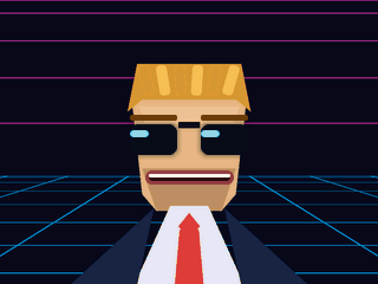
</p>

<h1 align="center">StackChan MAX</h1>

<p align="center">
  <b>A palm-sized desk robot with a face you can swap, a brain you choose,<br>and a control panel it serves itself.</b>
</p>

<p align="center">
  <a href="https://pingywon.github.io/stackchan-max/"><b>See the site</b></a> ·
  <a href="#try-it-without-a-robot">Try it without a robot</a> ·
  <a href="docs/BUILD.md">Build and flash</a> ·
  <a href="docs/STATUS.md">Full status</a>
</p>

StackChan MAX is custom firmware for the [M5Stack StackChan](https://docs.m5stack.com/en/StackChan),
a small open-source robot. The firmware calls itself **StackyChan**. It keeps what
M5Stack's own firmware does, minus the silent self-update, and adds the fun parts below.

**Version `9.9.3-stackychan`**, set in one place ([`firmware/CMakeLists.txt`](firmware/CMakeLists.txt)).
The robot shows the same string on its control panel and in its boot log.

> **Honest status.** One person, one real robot. Some of this has been seen working on
> the robot; some has only been built and simulated. [The list at the bottom](#honest-status)
> says which. The pictures here come from the real code running in a simulator and a
> mock server, with demo data. They are not photos of the hardware.

## What it can do

- **Wear a new face.** MAX, a 1980s TV host made of signal. VOLT, a neon heads-up
  display. Or M5Stack's stock face. Pick one on the control panel or on the robot itself.
- **Talk through the AI you choose.** Claude, ChatGPT, or a free one: Groq, Gemini,
  OpenRouter, Cerebras, Mistral, or Ollama running on your own computer.
- **Be somebody.** Save up to 8 characters. Each has a name, a personality, a voice, a
  speaking speed and a face.
- **Answer to 11 names.** Hi Stack Chan, Jarvis, Computer, Hi M Five, Hi Wall-E, Mycroft,
  Hey Wanda, Hey Willow, Sophia, Hey Kira, Hi Jason. All heard on the robot's own chip.
- **Move when you ask.** Turn or tilt its head, change its light colours, or play a
  gesture: happy, robot, panic, look around.
- **Look where it is going.** The eyes lead the head into a turn and settle when it stops.
- **Be useful.** Tell you the weather, set reminders, pause the ad-blocker on a Pi-hole.
- **Remember you.** Write notes once ("has a cat named Pixel") and it knows them in every chat.
- **Sit on your desk as a clock,** a weather display or a stock ticker.
- **Learn new tricks.** Plug in any MCP tool server and the robot can use it (Claude only).

## The faces

<table>
  <tr>
    <td align="center"><br><b>MAX</b><br>a 1980s TV host made of signal</td>
    <td align="center">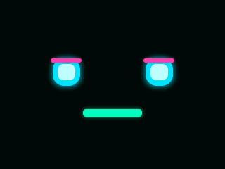<br><b>VOLT</b><br>a neon heads-up display</td>
    <td align="center">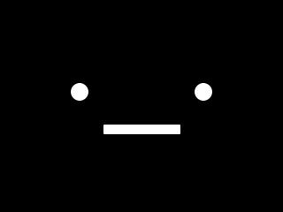<br><b>Default</b><br>M5Stack's stock face</td>
  </tr>
</table>

Every face shows the same six moods. The AI picks the mood; the face decides how it looks.

<p align="center">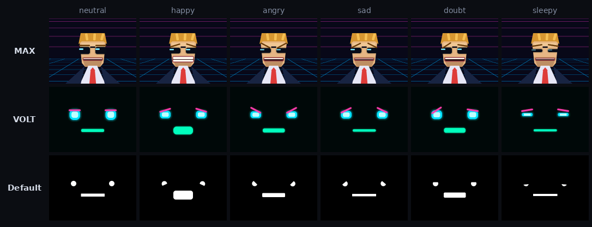</p>

**Make your own.** A face is one C++ class. Blinking, breathing, lip-sync and gaze come free.

1. Draw the art. [`workshop/design/`](workshop/design/) has the scripts that drew MAX.
2. Convert it with [`workshop/tools/photo2asset.py`](workshop/tools/photo2asset.py). Any photo or PNG works.
3. Write the class and register it in `firmware/main/stackchan/avatar/skins/skins.cpp`.
4. Render it in [the simulator](workshop/sim/README.md) before you build firmware.

<p align="center">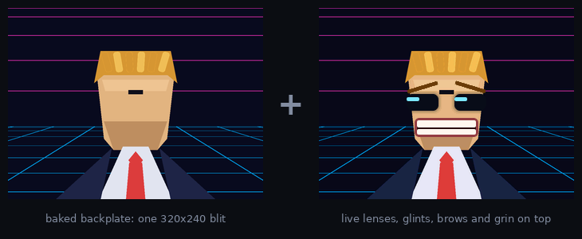</p>

*MAX's background is one stored picture. Only the sunglasses, eyebrows and grin are drawn live.*

## Pick your AI

The robot holds no AI. It is a microphone, a speaker and a face. It hears its wake word
on its own chip, then sends your voice to a small program called the **bridge**, which
runs on any computer on your network. The bridge asks the AI and sends the answer back as speech.

So you choose the AI on a web page, not in the firmware. Paste a key, tap who answers.
It takes effect on the next thing you say.

<p align="center">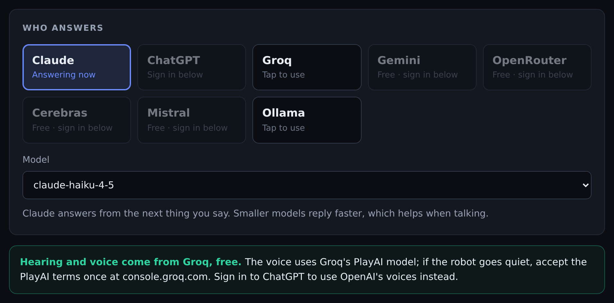</p>

| | who | what you need |
|---|---|---|
| Paid | Claude (Anthropic), ChatGPT (OpenAI) | an API key |
| Free | Groq, Google Gemini, OpenRouter's free models, Cerebras, Mistral | a free API key |
| Yours | any model on [Ollama](https://ollama.com/) | just its address, no key |

- **Keys stay on the bridge.** They never go to the robot and are never shown again.
- **Hearing and the voice are separate from who answers.** OpenAI or Groq must be signed
  in for those. Groq does both for free.
- **Want a different server?** The robot speaks the open [xiaozhi](https://github.com/78/xiaozhi-esp32)
  protocol. The message format is in [`server/bridge/README.md`](server/bridge/README.md), so you can write your own.

<details>
<summary>The whole sign-in page</summary>
<p align="center"></p>
</details>

<details>
<summary>How one conversation flows</summary>

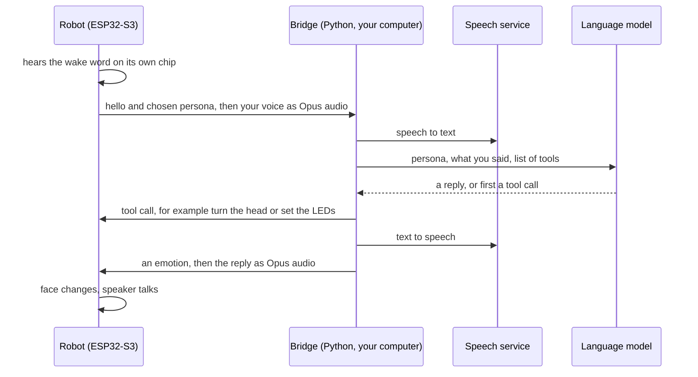

</details>

## The control panel

The robot serves its own settings page at `http://stackchan.local/`. No app, no cloud,
no install. It works on a phone too.

<p align="center">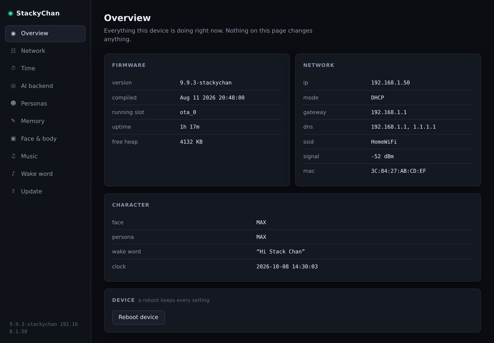</p>

<table>
  <tr>
    <td width="50%">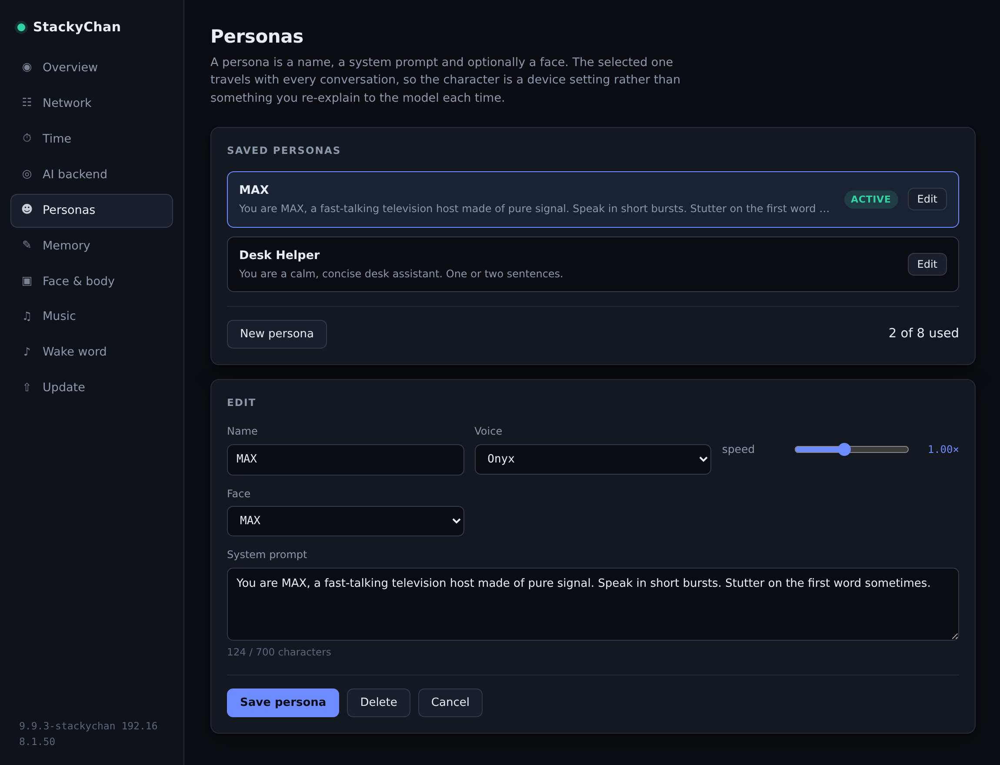</td>
    <td width="50%">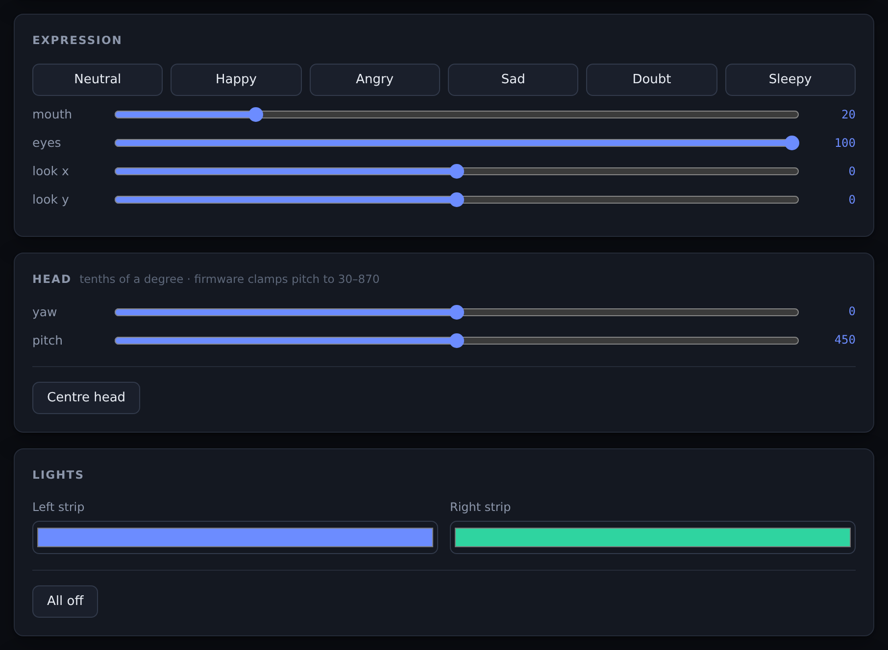</td>
  </tr>
  <tr>
    <td align="center"><i>Characters: name, voice, speed, face, personality</i></td>
    <td align="center"><i>Live control: mood, eyes, head, lights</i></td>
  </tr>
  <tr>
    <td width="50%">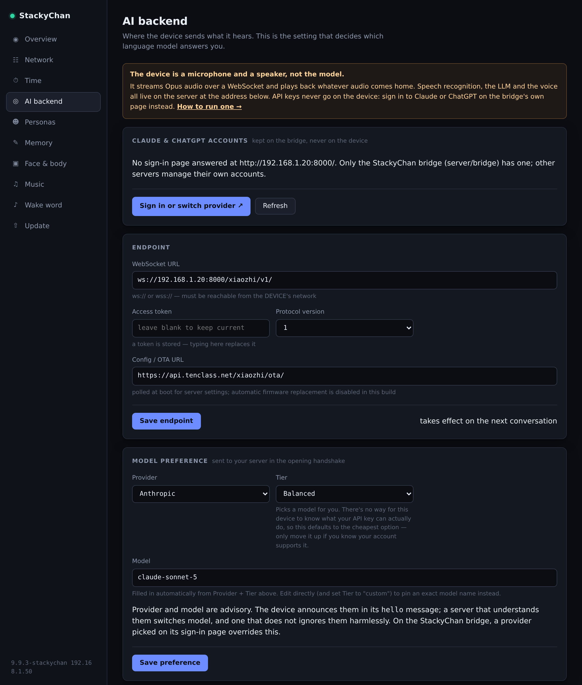</td>
    <td width="50%" align="center">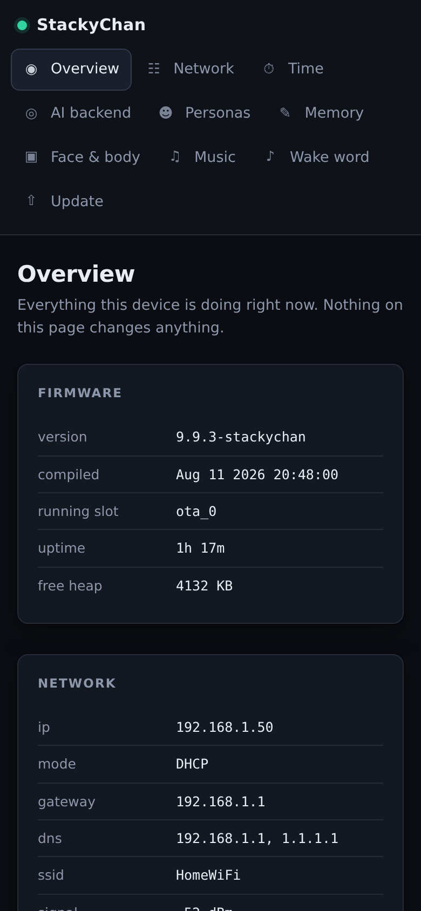</td>
  </tr>
  <tr>
    <td align="center"><i>AI backend: which server, which model</i></td>
    <td align="center"><i>The same panel on a phone</i></td>
  </tr>
</table>

Ten pages: overview, network, time, AI backend, personas, memory, face and body, music,
wake word, update.

- **A wrong network address cannot lock you out.** If you never reach the new address,
  the robot goes back to automatic addressing after two minutes.
- **Update by drag and drop.** The file goes up in small pieces, each retried on its own.
- **Your build stays yours.** Stock firmware replaces itself at boot without asking. That is switched off here.

There is also a [keyframe editor](workshop/portal/keyframe-editor.html) for moves and
expressions, and a [Windows recovery kit](workshop/kit/README.md) that can always put
M5Stack's firmware back.

## Built with Claude

I built this with [Claude Code](https://claude.com/claude-code), Anthropic's coding
assistant, starting in August 2026. Claude wrote the code. I steered, flashed the robot
and reported back what really happened.

A feature usually went like this:

1. **I say what I want, in plain words.** "Give it a Max Headroom face." "Let me pick the AI from a web page."
2. **Claude reads M5Stack's source and writes the change.** C++ for the robot, a web page for the panel, Python for the bridge.
3. **Claude checks its own work.** The simulator draws the real face code as pictures. A
   mock server runs the real control panel. A fake robot holds a whole conversation with
   fake AI providers (137 checks).
4. **I flash the robot by USB and paste the boot log back.**
5. **We fix what the real hardware disagreed with.** Those stories are in [docs/LESSONS.md](docs/LESSONS.md).

One thing shaped all of it: the computer Claude works on has no USB port. It can compile
and simulate, but it can never flash. That is why this repo has a simulator, a mock
server and a self-test, and why the status list says plainly what has only been simulated.

**Make it yours the same way.** Open this repo in Claude Code, or any coding assistant,
and start it at [docs/STATUS.md](docs/STATUS.md). It lists what is built, what is proven
and what is still open.

## Try it without a robot

No hardware and no API key needed.

**Click around the control panel.** The real page, with every answer faked:

```bash
python3 workshop/portal/mock_server.py --port 8130      # then open http://localhost:8130/
```

**Watch a fake robot have a conversation.** The bridge's self-test:

```bash
cd server/bridge
python3 -m venv .venv && . .venv/bin/activate
pip install -r requirements.txt        # also needs the system libopus (apt install libopus0)
python selftest.py                     # ends with "all checks passed"
```

**Draw the faces.** The simulator writes every face and mood as a PNG. Steps are in
[`workshop/sim/README.md`](workshop/sim/README.md).

## Build and flash

You need an M5Stack StackChan kit and ESP-IDF 5.5.4. There is no prebuilt download.

```bash
cd firmware
python3 fetch_repos.py      # must print "Applied patch" 9 times and never "skipped"
idf.py set-target esp32s3
idf.py build
```

The first install needs a USB cable. The full steps, the flash command and the way back
to stock are in **[docs/BUILD.md](docs/BUILD.md)**.

## Honest status

**Seen on the real robot**

- the MAX face on the screen
- the control panel, served by the robot
- the wake word firing
- stock firmware replacing a custom build, which is why the guard exists

**Built and tested on a computer, not yet confirmed on the robot**

- a full spoken conversation (the bridge's self-test passes; no real chat has happened yet)
- the VOLT face, gaze, live face switching
- gestures, and the weather and Pi-hole tools
- the clock, weather and stock screens
- drag-and-drop update

**Blocked**

- music from the SD card. On this board the card and the screen share a wire.

The detail behind every line is in [docs/STATUS.md](docs/STATUS.md).

## Credits

- **[M5Stack](https://m5stack.com/)** makes the StackChan kit and publishes the firmware
  this is forked from: [m5stack/StackChan](https://github.com/m5stack/StackChan), at
  their commit `b72b3ed` (2 July 2026). Their code, notices and licence files are kept.
- **The Stack-chan project** was created by Shinya Ishikawa
  ([@stack_chan](https://x.com/stack_chan)) and carried by its community, including
  Takao Akaki ([@mongonta555](https://x.com/mongonta555)).
- **[xiaozhi-esp32](https://github.com/78/xiaozhi-esp32)** by 78 is the voice-assistant
  firmware underneath, and its protocol is what the bridge speaks.
- **[LVGL](https://lvgl.io/)** draws the faces. **Mooncake** and **smooth_ui_toolkit** by
  Forairaaaaa are the app and UI framework. **ESP-IDF** and **ESP-SR** by Espressif are
  the platform and the wake-word engine.
- **[Open-Meteo](https://open-meteo.com/)** provides the weather data.
- MAX is a fan tribute to the 1980s TV character Max Headroom. This project is not
  affiliated with or endorsed by the owners of that character, by M5Stack, or by any
  AI provider named here.

## Licence

MIT, the same as upstream.

M5Stack's code is copyright (c) 2026 M5Stack Technology CO LTD. Their licence files are
kept unchanged in [`firmware/`](firmware/LICENSE), [`server/`](server/LICENSE) and
[`remote/code/`](remote/code/LICENSE). Files added by this fork carry an MIT header of
their own. The [LICENSE](LICENSE) at the top of the repo holds both notices.

Two bundled drivers keep their own terms: the Feetech servo library (MIT) and Bosch's
BMI270 sensor API (BSD-3-Clause). Their licence files sit beside the code.
