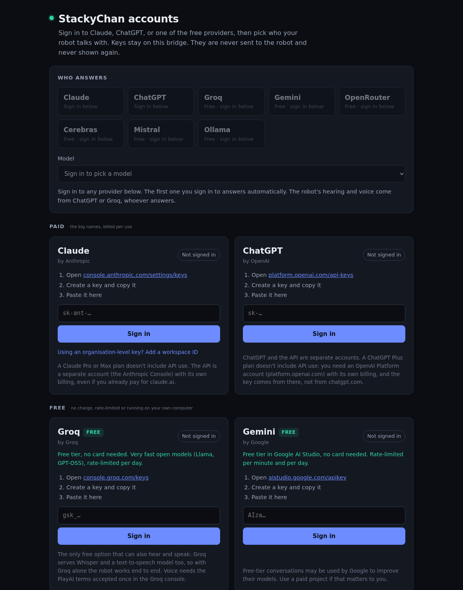

# StackyChan bridge — run the robot on any LLM

## The short answer to "can I use a different model?"

Yes, but not by putting an API key on the device.

The StackChan firmware is a **thin audio client**. It captures speech, encodes it as Opus,
streams it over a WebSocket, and plays back whatever audio comes home. There is no language
model in it, no text, and nowhere to put a key — the whole conversation happens on a server.
That is true of stock M5Stack firmware and of this fork.

So the model is chosen by **which server the device points at**. This directory is such a
server. Point the portal's *AI backend → WebSocket URL* at it and the device talks to
Claude, ChatGPT, or one of the free providers: Groq, Google Gemini, OpenRouter's free
models, Cerebras, Mistral, or a model on your own machine via Ollama.

```
StackChan  ──Opus over WebSocket──▶  bridge  ──▶  ASR   (speech to text: OpenAI or Groq)
                                             ──▶  LLM   (Claude / ChatGPT / Groq / Gemini / …)
           ◀──Opus over WebSocket──          ◀──  TTS   (text to speech: OpenAI or Groq)
```

<p align="center"></p>

## The "paste a key and go" path

Start the bridge (see **Running it** below), then:

1. Open `http://<bridge-host>:8000/` in any browser on your network.
2. Sign in to Claude, ChatGPT or a free provider, and pick who answers.
3. On the robot's portal, set **AI backend → WebSocket URL** to
   `ws://<bridge-host>:8000/xiaozhi/v1/`.

No file editing, no restart. `curl http://<bridge-host>:8000/health` tells you it is alive.
The bridge starts cleanly with no key set, and only fails per request until one is
added, so "install it" and "give it a key" are two separate, low-risk steps.

**Keeping it running.** The author runs it as a systemd service
(`stackychan-bridge.service`, auto-restart) from a copy of this directory kept outside
the repo, with its own venv, so it keeps running whichever branch is checked out.
`journalctl -u stackychan-bridge -f` follows its log. Any other way of keeping a Python
program alive works just as well.

**Mind who can reach it.** Anyone who can open the page can change which account
answers. Run it on a network you trust, or set `BRIDGE_TOKEN`.

## Signing in: Claude, ChatGPT, and the free providers

The bridge serves its own sign-in page at `/`. The robot's portal links to it from the AI
backend page and shows live status from it. Every provider the bridge knows is one entry
in `providers.py`; the page builds itself from that list.

| provider | cost | key looks like | can also hear/speak |
|---|---|---|---|
| Claude (Anthropic) | paid, per use | `sk-ant-…` | no |
| ChatGPT (OpenAI) | paid, per use | `sk-…` | yes (Whisper + TTS) |
| Groq | **free tier**, no card | `gsk_…` | **yes** (Whisper + PlayAI TTS) |
| Gemini (Google AI Studio) | **free tier**, no card | `AIza…` | no |
| OpenRouter | **free models only** are listed | `sk-or-…` | no |
| Cerebras | **free tier**, no card | `csk-…` | no |
| Mistral | **free "Experiment" plan** (phone verification) | no fixed prefix | no |
| Ollama | **free, local** | no key, just the computer's address | no |

- **Sign in** = paste an API key. The bridge checks it by listing the provider's models
  (free, no tokens used) and saves it only if the provider accepts it. A rejected key, a
  network failure, or a key pasted in the wrong box (every provider's key has a
  recognisable start) is explained on the page and nothing is saved. Ollama has no key:
  paste the address of the computer running it and the bridge checks it can list models
  there (start Ollama with `OLLAMA_HOST=0.0.0.0` if it's not the bridge's own machine).
- **Any number at once.** Each provider keeps its own key. "Who answers" picks one, and the
  model list under it comes from what that key can actually use, small fast models first.
  OpenRouter lists only the models it marks free. The first account you sign in to
  answers automatically.
- **ChatGPT and the API are separate accounts.** A ChatGPT Plus subscription does not
  include API use; the key comes from an OpenAI *Platform* account (platform.openai.com)
  with its own billing. Same story for Claude: Pro/Max don't include the API, the key comes
  from the Anthropic Console. The page says so on each card.
- **Organisation-level Claude keys.** Anthropic has two kinds of key. One made inside a
  workspace just works. One made at the organisation level is refused ("not scoped to a
  workspace") until each request names a workspace, so the page asks for the workspace ID
  (Console → Settings → Workspaces, `wrkspc_…`) when Anthropic says so and the bridge sends
  it as the `anthropic-workspace-id` header from then on. `ANTHROPIC_WORKSPACE_ID` does
  the same for a key in `bridge.env`.
- **Live.** Keys and the choice apply from the next thing said to the robot. They're saved
  to `accounts.json` next to `bridge.py` (owner-only permissions, git-ignored) and survive
  restarts.
- **The page's choice wins** over the provider in the robot's own portal and over
  `BRIDGE_LLM_PROVIDER`. The page says when the robot asks for a different one. Sign out of
  everything and the old behaviour returns.
- **Hearing and the voice are separate from who answers.** They're OpenAI-shaped speech
  calls, which only ChatGPT and Groq serve: an explicit `BRIDGE_ASR_KEY`/`BRIDGE_TTS_KEY`
  wins, then ChatGPT (Whisper + `gpt-4o-mini-tts`), then Groq (`whisper-large-v3-turbo` +
  `playai-tts`, free; the voice needs the PlayAI terms accepted once in the Groq console,
  and persona voice names are mapped onto the nearest PlayAI voice). A Claude-only or
  Gemini-only setup can think but not hear or speak; the page warns until one of the two
  speech providers is signed in.
- **Tools on free models.** Device tools, Pihole and weather work on every provider that
  does OpenAI-style function calling. A model that doesn't (some free ones) gets the same
  question again without tools, so the robot still answers, it just can't move that turn.
- **Why API keys and not "Sign in with…".** No provider offers a login that a third-party
  app like this can use for API access. The page links straight to each one's keys page.
- **Keys in `bridge.env` still work.** They show as signed in ("set in bridge.env") and a
  key saved on the page takes priority. Signing out of an env key has to be done in the file.
- **Who can change it.** Anyone who can open the page. Keys are never sent back, only
  their last four characters (Ollama's address is shown in full; it isn't a secret). Writes
  need an `X-StackyChan: 1` header, so other websites can't sign the bridge in or out from
  a browser, and if `BRIDGE_TOKEN` is set the page asks for it before any change.

API: `GET /api/accounts` (status, CORS-readable, no keys), and `POST /api/accounts/signin`
`{provider, key, workspace?}`, `/workspace` `{workspace}` (Claude only), `/signout`
`{provider}`, `/choose` `{provider, model?}`. `provider` is any id in `providers.py`:
`anthropic`, `openai`, `groq`, `gemini`, `openrouter`, `cerebras`, `mistral`, `ollama`.
A sign-in refused for want of a workspace answers `400` with `"needs": "workspace"`.

## Running it

```bash
cd server/bridge
python3 -m venv .venv && . .venv/bin/activate
pip install -r requirements.txt
sudo apt install libopus0            # or: brew install opus

python bridge.py                     # then sign in on its page, or:

export ANTHROPIC_API_KEY=sk-ant-…    # the model
export OPENAI_API_KEY=sk-…           # used for speech in and speech out
python bridge.py
```

Keys can come from the sign-in page or from the environment. The page is easier and
keeps them out of your shell history.

Then in the portal, on the **AI backend** page:

| field | value |
|---|---|
| WebSocket URL | `ws://<the machine running this>:8000/xiaozhi/v1/` |
| Provider | Anthropic |
| Model | `claude-sonnet-5` |

The URL has to be reachable **from the device's network**, which is not always yours.

Check it is alive: `curl http://localhost:8000/health`

## Configuration

Every setting is an environment variable. `python config.py` prints the resolved
configuration with secrets masked, which is the fastest way to find a typo.

| variable | default | what it does |
|---|---|---|
| `BRIDGE_HOST` / `BRIDGE_PORT` / `BRIDGE_PATH` | `0.0.0.0` / `8000` / `/xiaozhi/v1/` | where to listen |
| `BRIDGE_TOKEN` | *(empty)* | required `Authorization: Bearer` value; empty disables the check |
| `BRIDGE_LLM_PROVIDER` | `anthropic` | `anthropic`, `openai`, `groq`, `gemini`, `openrouter`, `cerebras`, `mistral`, `ollama`, `openai-compatible` |
| `BRIDGE_LLM_MODEL` | per provider | overrides the default model |
| `ANTHROPIC_API_KEY` / `ANTHROPIC_WORKSPACE_ID` | — | Claude; the workspace ID only for organisation-level keys. A key signed in on the page overrides it |
| `OPENAI_API_KEY` / `OPENAI_BASE_URL` | — / `https://api.openai.com/v1` | ChatGPT, and (as `openai-compatible`) anything that copies its API; a key signed in on the page overrides it |
| `GROQ_API_KEY`, `GEMINI_API_KEY`, `OPENROUTER_API_KEY`, `CEREBRAS_API_KEY`, `MISTRAL_API_KEY` | — | the free providers, each at its own known endpoint; a key signed in on the page overrides it |
| `BRIDGE_ACCOUNTS_FILE` | `accounts.json` beside `bridge.py` | where the sign-in page saves keys and the chosen provider |
| `OLLAMA_BASE_URL` | *(empty; `http://127.0.0.1:11434` is assumed when the provider is `ollama`)* | a local model; the page's "Connect" sets this too |
| `BRIDGE_ASR_PROVIDER` / `BRIDGE_ASR_MODEL` | `openai` / `whisper-1` | speech to text |
| `BRIDGE_ASR_KEY` / `BRIDGE_ASR_BASE_URL` / `BRIDGE_ASR_LANGUAGE` | — / — / `en` | a separate key or endpoint for speech to text, and the language hint |
| `BRIDGE_TTS_PROVIDER` / `BRIDGE_TTS_MODEL` / `BRIDGE_TTS_VOICE` | `openai` / `gpt-4o-mini-tts` / `alloy` | speech out |
| `BRIDGE_TTS_KEY` / `BRIDGE_TTS_BASE_URL` / `BRIDGE_TTS_SPEED` | — / — / `1.0` | a separate key or endpoint for the voice, and its default speed |
| `BRIDGE_VAD_SILENCE_MS` / `BRIDGE_VAD_THRESHOLD` / `BRIDGE_MAX_UTTERANCE_MS` | `900` / `500` / `15000` | silence that ends a turn, how loud counts as speech, and the longest turn |
| `BRIDGE_HISTORY_TURNS` | `8` | conversation turns kept in context; the robot's Memory page can override it per device |
| `BRIDGE_DEFAULT_PROMPT` | see `config.py` | used when no persona is selected |
| `BRIDGE_ALLOW_DEVICE_MODEL` | `1` | let a device pick its own provider/model |
| `BRIDGE_ENABLE_DEVICE_TOOLS` | `1` | relay the device's own MCP tools to the model (every provider) |
| `BRIDGE_MCP_SERVERS` | *(empty)* | JSON list of external MCP servers — see **MCP tools** below |
| `WEATHER_LOCATION` | *(empty)* | a place name or `lat,lon` for the weather tool; the robot's portal can send its own |
| `PIHOLE_URL` | *(empty)* | address of a Pi-hole; setting it switches the Pi-hole tools on |
| `PIHOLE_API_TOKEN` / `PIHOLE_PASSWORD` / `PIHOLE_API_VERSION` | — / — / `auto` | Pi-hole v5 token, v6 password, and `5`, `6` or `auto` |
| `KIE_API_KEY` / `KIE_BASE_URL` / `KIE_MODEL` | — | reserved for a media-generation tool that is **not written yet**; nothing reads these today beyond storing them |
| `BRIDGE_LOG_LEVEL` | `INFO` | `DEBUG` for the first live conversation |

With no `BRIDGE_LLM_MODEL` set, `anthropic` resolves to **`claude-sonnet-5`** — the
current default Claude model. Point `BRIDGE_LLM_MODEL` at something else (`claude-opus-5`
for harder reasoning, `claude-haiku-4-5` for the cheapest/fastest replies) to change it;
nothing else needs updating.

### Mixing providers

Nothing forces one vendor. A common shape is a local model for the thinking and hosted
services for the ears and voice:

```bash
export BRIDGE_LLM_PROVIDER=ollama
export BRIDGE_LLM_MODEL=llama3.2
export OPENAI_API_KEY=sk-…      # still used for ASR and TTS
```

Or Groq for everything, free, since it serves chat, Whisper and a voice:

```bash
export BRIDGE_LLM_PROVIDER=groq
export GROQ_API_KEY=gsk_…
```

With no ChatGPT key, hearing and the voice fall back to Groq on their own. Any other
OpenAI-compatible server (LM Studio, vLLM, together.ai) is `BRIDGE_LLM_PROVIDER=
openai-compatible` + `OPENAI_BASE_URL` + `OPENAI_API_KEY` + `BRIDGE_LLM_MODEL`.

## MCP tools

The model can call tools from three sources. The first two work on every provider that
does OpenAI-style function calling (all of them, on their capable models); the third is
Anthropic-only.

**The robot's own tools, automatically.** `firmware/xiaozhi-esp32/main/mcp_server.cc` already
exposes a handful of device tools over the same websocket the audio rides on, and
`firmware/main/hal/hal_mcp.cpp` adds this robot's: read or set the head angles, set the
LED colour, create, list and stop reminders, and `play_gesture` (happy, robot, panic,
look_around). `list_songs` and `dance_to_song` are registered only when an SD card is
mounted, which cannot happen yet (see the main README).
`BRIDGE_ENABLE_DEVICE_TOOLS=1` (the default) discovers that list right after the device's
hello and hands it to the model as ordinary tools, prefixed `device_` so they can never
collide with another tool of the same name. Ask it to change the lights and it
just does — no configuration beyond leaving the default on. Set the variable to `0` to
turn this off (e.g. running the bridge against something other than this firmware, whose
MCP server speaks a different tool set).

**Tools built into the bridge: weather and Pi-hole.** These live here rather than on the
robot because the network and any credentials do.

- `weather_get_current` and `weather_get_forecast` use [Open-Meteo](https://open-meteo.com/),
  which is free and needs no key. They switch on when a location is known: set one on
  the robot's portal (AI backend page), or `WEATHER_LOCATION` here. A place name is looked
  up once; `lat,lon` is used as given.
- `pihole_get_stats`, `pihole_disable` and `pihole_enable` switch on when `PIHOLE_URL` is
  set. "Turn off ad blocking for ten minutes" uses Pi-hole's own timer, so blocking comes
  back even if the bridge is restarted. Pi-hole v5 is the tested shape (in the self-test,
  against faked replies). The v6 path is written from Pi-hole's published API notes and
  has never met a real v6 install.

**Any external MCP server, via Anthropic's native MCP connector — the "room for more"
knob.** Add an entry to `BRIDGE_MCP_SERVERS` and the model gets a new tool with no code
change:

```bash
export BRIDGE_MCP_SERVERS='[
  {"name": "weather", "url": "https://mcp.example.com/sse"},
  {"name": "home", "url": "https://home.example.com/mcp", "token": "your-bearer-token"}
]'
```

Each entry needs `name` and `url`; `token` is optional and sent as the server's bearer
token. These calls are resolved entirely server-side by Anthropic — the bridge never sees
the request or the result, only the finished conversation. A malformed entry is logged and
skipped rather than crashing the bridge, so a typo in one server doesn't take the others
down with it.

All three sources appear in the same tool list on the same turn — the model can move the
LED strip and check the weather in one exchange without knowing they are implemented
differently.

### The same tools on xiaozhi.me's own cloud

`xiaozhi_mcp_relay.py` is a separate, optional program. If you keep the robot on the
stock xiaozhi.me cloud instead of this bridge, the relay offers the weather and Pi-hole
tools to that cloud's agent through its "MCP Access Point". It needs `XIAOZHI_MCP_TOKEN`
(from the xiaozhi.me app's MCP screen; keep it out of any repo) and connects out to
`XIAOZHI_MCP_URL`. The handshake, tool list and keep-alive have been checked against the
real service. A real tool call through it has not.

## Personas

A persona created in the portal is sent to this bridge in the opening handshake and becomes
the **system prompt** for that conversation. Its `voice` and `speed`, if set, are passed to
the TTS provider. Nothing needs configuring here — select a persona in the portal and the
character changes on the next thing you say. The portal's Memory notes ride along in the
same handshake and are added to every system prompt, whichever persona is active.

This is a fork-local addition (`firmware/patches/stackychan-persona-hello.patch`). Stock
xiaozhi servers ignore the extra fields, so a device configured this way still works against
one.

## The protocol

Useful if you would rather write your own server. Taken from
`firmware/xiaozhi-esp32/main/protocols/` in this repo.

**Connect.** WebSocket, with headers `Authorization: Bearer <token>`, `Protocol-Version: 1`,
`Device-Id` (the MAC), `Client-Id` (a UUID).

**Device → server**

```jsonc
{"type":"hello","version":1,"transport":"websocket","features":{"mcp":true},
 "audio_params":{"format":"opus","sample_rate":16000,"channels":1,"frame_duration":60},
 "persona_id":"max",                                   // fork-local
 "persona":{"id":"max","name":"MAX","prompt":"…"},     // fork-local
 "llm":{"provider":"anthropic","model":"claude-sonnet-5"},  // fork-local
 "memory_notes":"…","weather_location":"…",            // fork-local, each only when set
 "history_turns":8,"kie_model":"…"}

{"type":"listen","state":"start","mode":"auto"}   // then binary Opus frames
{"type":"listen","state":"stop"}                  // manual mode only
{"type":"listen","state":"detect","text":"Hi Stack Chan"}   // wake word fired
{"type":"abort","reason":"wake_word_detected"}
{"type":"mcp","payload":{…}}                      // the device's own tool interface
```

**Server → device**

```jsonc
{"type":"hello","transport":"websocket","session_id":"…",
 "audio_params":{"sample_rate":16000,"frame_duration":60}}

{"type":"stt","text":"what the user said"}            // shown on screen
{"type":"llm","emotion":"happy"}                      // drives the face
{"type":"tts","state":"start"}
{"type":"tts","state":"sentence_start","text":"…"}    // shown on screen
   … binary Opus frames …
{"type":"tts","state":"stop"}
{"type":"alert","status":"error","message":"…","emotion":"sad"}
{"type":"system","command":"reboot"}
```

Binary frames are **raw Opus packets** at protocol version 1. Versions 2 and 3 add a
header; this bridge speaks version 1, which is what the firmware defaults to.

`emotion` must be one of `neutral`, `happy`, `angry`, `sad`, `doubt`, `sleepy` — anything
else is dropped by the skins.

In `auto` mode the device streams continuously and the **server** decides when a turn ended.
That is what the silence detector in `bridge.py` does. In `manual` mode the device sends
`listen/stop` itself.

## Testing

```bash
python selftest.py
```

Runs a fake device through a complete turn with the providers stubbed out, checking the
handshake, the silence detector, persona routing, sentence splitting and audio framing —
plus, separately, the device-tool relay (a fake device answering real MCP JSON-RPC
messages) and the tool-use HTTP loop (a fake Anthropic endpoint, checked for the exact
request body: the device tool offered, the configured MCP server turned into an
`mcp_toolset`, the `mcp-client-2025-11-20` beta header, and no double-appended history
across a tool round trip). It also covers the sign-in store (key checks, rejected and
wrong-box keys, model filtering, choosing, sign-out fallback, env keys, file permissions,
no key leaking into status) and the page's HTTP API through a real server. It needs no API
keys and no hardware, so it is safe to run on every change.

**What has been verified and what has not.** The protocol, audio framing, device-tool
relay wire format, both tool-use loops, the weather and Pi-hole tools and the sign-in
store are covered by `selftest.py`: 137 checks, all against a fake device and faked web
replies, all passing (last run 2026-10-05). The sign-in page has also been driven in a
browser with fake keys, to see each provider's real "wrong key" reply. That is where the
evidence stops. **No real conversation has happened.** The provider calls — Anthropic,
Whisper, TTS, Groq's speech, every free provider's chat — are written against each
vendor's documented API but have never run with a working key, and the bridge has never
been connected to the physical robot. Treat the first live conversation as the real
test, and `BRIDGE_LOG_LEVEL=DEBUG` as the tool for it.

## Files

| file | what it is |
|---|---|
| `bridge.py` | the WebSocket server and the turn state machine |
| `providers.py` | the one table of providers: endpoints, key shapes, free-tier notes, preferred models |
| `llm.py` | the two wire shapes (Anthropic, OpenAI chat completions) and both tool-use loops |
| `mcp_device.py` | MCP client that relays the device's own tools to the model |
| `weather.py` | the weather tools (Open-Meteo, no key) |
| `pihole.py` | the Pi-hole tools (v5, and best-effort v6) |
| `xiaozhi_mcp_relay.py` | optional: offers the weather and Pi-hole tools to the stock xiaozhi.me cloud |
| `speech.py` | Opus codec, WAV handling, ASR and TTS calls |
| `pcm.py` | RMS, downmix and resample, without `audioop` (removed in Python 3.13) |
| `config.py` | every setting, resolved from the environment |
| `accounts.py` | sign-in for every provider: key checks, workspace IDs, `accounts.json`, who answers, who does speech |
| `accounts_page.html` | the sign-in page served at `/` |
| `selftest.py` | a fake device, no keys required |
